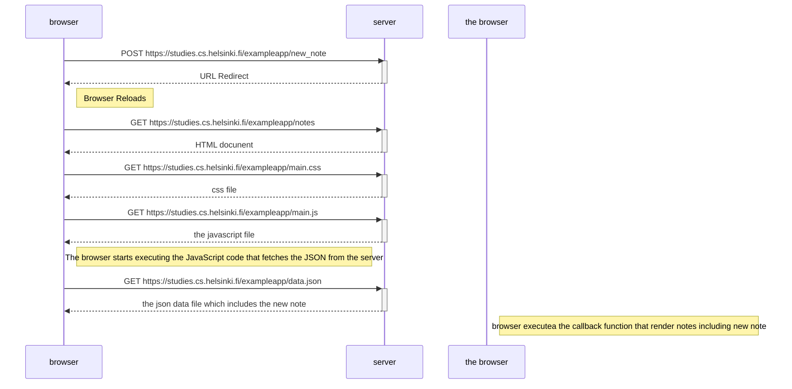
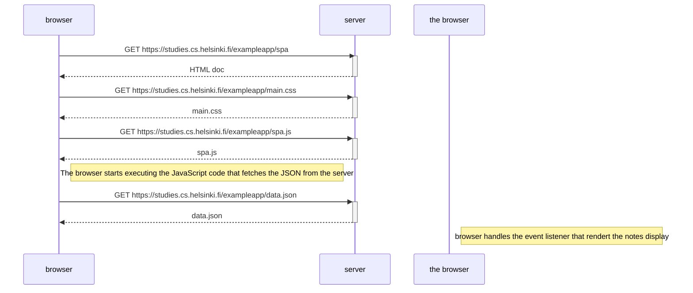
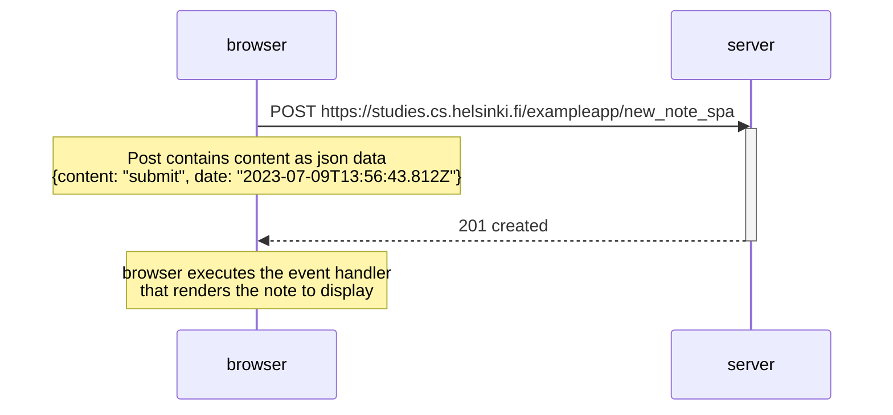

### 0.4: New note diagram

```mermaid
    sequenceDiagram
    participant browser
    participant server
    browser->>server: POST https://studies.cs.helsinki.fi/exampleapp/new_note
    activate server
    server-->>browser: URL Redirect
    deactivate server
    Note right of browser: Browser Reloads
    browser ->> +server: GET https://studies.cs.helsinki.fi/exampleapp/notes
    server -->> -browser: HTML docunent

    browser ->> +server: GET https://studies.cs.helsinki.fi/exampleapp/main.css
    server -->> -browser: css file

    browser ->> +server: GET https://studies.cs.helsinki.fi/exampleapp/main.js
    server -->> -browser: the javascript file

    NOte right of browser: The browser starts executing the JavaScript code that fetches the JSON from the server

    browser ->> +server: GET https://studies.cs.helsinki.fi/exampleapp/data.json
    server -->> -browser: the json data file which includes the new note

    Note right of the browser: browser executea the callback function that render notes including new note
```

### 0.5: Single page app diagram

```mermaid
    sequenceDiagram
    participant browser
    participant server
    browser->>server: GET https://studies.cs.helsinki.fi/exampleapp/spa
    activate server
    server-->>browser: HTML doc
    deactivate server
    browser ->> +server: GET https://studies.cs.helsinki.fi/exampleapp/main.css
    server -->> -browser: main.css

    browser ->> +server: GET https://studies.cs.helsinki.fi/exampleapp/spa.js
    server -->> -browser: spa.js

    NOte right of browser: The browser starts executing the JavaScript code that fetches the JSON from the server

    browser ->> +server: GET https://studies.cs.helsinki.fi/exampleapp/data.json
    server -->> -browser: data.json

    Note right of the browser: browser handles the event listener that rendert the notes display

```

### 0.6: New Note in Single page app diagram

```mermaid
    sequenceDiagram
    participant browser
    participant server
    browser->>server: POST https://studies.cs.helsinki.fi/exampleapp/new_note_spa
    activate server
    Note over browser: Post contains content as json data <br> {content: "submit", date: "2023-07-09T13:56:43.812Z"}
    server-->>browser: 201 created
    deactivate server

    Note over browser: browser executes the event handler <br> that renders the note to display
    
```

